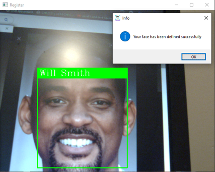
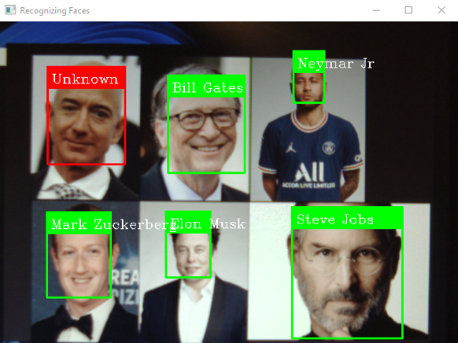
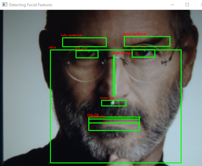

# Advanced Face Recognition System

The Advanced Face Recognition System is a powerful and accurate solution developed using deep learning and dlib's advanced technology. It offers seamless face detection, recognition, and facial feature analysis capabilities. This project showcases the potential of face recognition technology in various applications, from identity verification to personalized experiences.

## Features

- Accurate face detection using dlib's pretrained models.
- Precise facial landmark detection with 68 facial landmark mapping.
- Efficient face recognition with a remarkable 99.38% accuracy rate.
- Secure face registration and user identification.
- Real-time face recognition and identification via webcam integration.
- Visualizations of facial landmarks for enhanced user experience.
- Ability to redefine registered faces for profile updates.

## Requirements

- Python 3.7 or higher
- dlib library
- face_recognition library
- Webcam or image input source

## Installation

1. Clone the repository: `git clone https://github.com/your-username/face-recognition.git`
2. Install the required libraries.
3. Run the application: `python main.py`

## Usage

1. Launch the application and ensure your webcam is connected.
2. Register your face by providing your name and capturing your facial image.
3. To log in, simply present your face to the camera and let the system recognize you.
4. Explore the different features, such as face detection, facial landmark detection, and face recognition.

## Contributing

Contributions are welcome! If you encounter any issues or have suggestions for improvements, please feel free to open an issue or submit a pull request.

## Acknowledgements

- The dlib library: [https://github.com/davisking/dlib](https://github.com/davisking/dlib)
- The face_recognition library: [https://github.com/ageitgey/face_recognition](https://github.com/ageitgey/face_recognition)
